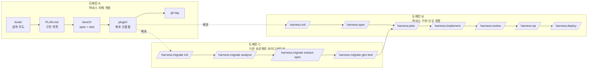
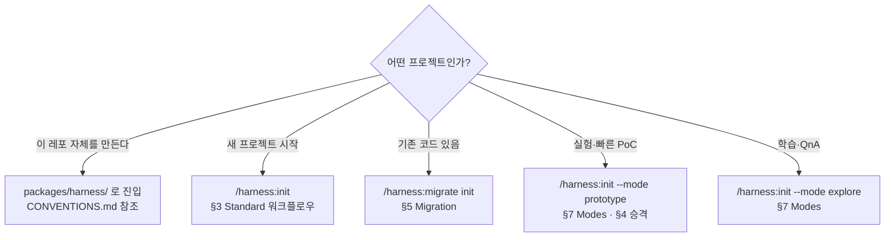

# 2. 3개 도메인 전체 그림

> 하네스는 **세 가지 대상**에서 동작한다. 같은 스킬이라도 어느 도메인에서 쓰느냐에 따라 의미가 다르다.

---

## 2.1 한눈에

---

## 2.2 도메인별 성격

| 도메인 | 대상 | 목적 | 주 사용자 | 위치 |
|--------|------|------|---------|------|
| **A. 하네스 자체 개발** | `packages/harness/` | 하네스 플러그인·스킬·에이전트를 만들고 검증 | 하네스 메인테이너 (우리) | `packages/harness/{book,bench,plugin}` |
| **B. 하네스 기반 개발** | 임의의 유저 프로젝트 | 새 제품을 spec → test → plan → code 로 풀 파이프라인 구축 | 하네스 플러그인 사용자 | 유저 프로젝트의 `.harness/` |
| **C. 마이그레이션** | 기존 코드가 있는 유저 프로젝트 | code → spec 역추출 → 점진적 래핑 → 도메인 B 에 합류 | 레거시 보유 사용자 | 유저 프로젝트의 `.harness/` |

---

## 2.3 같은 스킬, 다른 의미

| 스킬 | 도메인 A | 도메인 B | 도메인 C |
|------|---------|---------|---------|
| `/harness:spec` | bench/specs 에 AC 명세 YAML 작성 | 새 feature 의 AC 명세 작성 | **code → spec 역추출** (`migrate extract-spec`) |
| `/harness:implement` | plugin/ 코드 수정 | 새 TDD 구현 | 기존 코드를 래핑/보강 |
| `/harness:review` | bench/tests 기반 검증 | 4종 리뷰어 병렬 실행 | 기존 코드의 잠재 리스크 진단 |

---

## 2.4 도메인별 진입 가이드

---

## 2.5 같은 레이어를 공유하는 것

도메인이 달라도 **공통으로 동작**하는 레이어:

- **Safety Layer** — `block-destructive`, `block-force-push`, `protect-harness`. **모든 mode 에서 강제.**
- **Hook Pipeline** — SessionStart / UserPromptSubmit / Pre·PostToolUse / Stop. [§8](08-hook-lifecycle.md).
- **Observability** — `.harness/state/{audit.jsonl, events/, traces/}`. [§9](09-observability.md).

---

## 2.6 참고

- 상세 철학: [`../book/00-overview.md`](../book/00-overview.md), [`../book/01-philosophy.md`](../book/01-philosophy.md)
- 도메인별 워크플로우 디테일: [`../book/03-workflow.md`](../book/03-workflow.md)

---

[← 이전: 1. Quick Start](01-quick-start.md) · [인덱스](README.md) · [다음: 3. Standard 워크플로우 →](03-standard-workflow.md)
