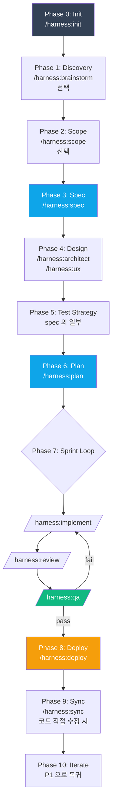
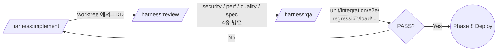

# 3. Standard 워크플로우

> 도메인 B(신규 개발) 의 메인 경로. Phase 0 ~ Phase 10. 각 단계의 **명령 · 입력 · 산출물 · Gate** 를 정리한다.

---

## 3.1 전체 Phase 흐름



> **파란색** = Iron Law Gate 로 강제되는 산출물 단계. **녹색** = 배포 전 마지막 관문. **주황** = 배포.

---

## 3.2 Phase 별 상세

| Phase | 명령 | 입력 | 산출물 | Gate |
|-------|------|------|--------|------|
| **0. Init** | `/harness:init` | — | `.harness/config.yaml`, 디렉토리 구조 | — |
| **1. Discovery** (선택) | `/harness:brainstorm <topic>` | 자연어 주제 | `.harness/brainstorms/{date}-{slug}.md` | — |
| **2. Scope** (선택) | `/harness:scope` | brainstorm 결과 | `.harness/specs/00-overview.md` | — |
| **3. Spec** | `/harness:spec <domain>/<feature>` | 요구사항 | `{feature}.spec.yaml`, `coverage.json` | AC 전부 testable |
| **4. Design** | `/harness:architect`, `/harness:ux` | Spec | `.harness/decisions/{nnn}-{title}.md` (ADR) | medium+ 에서 필수 |
| **5. Test Strategy** | (spec 의 일부) | Spec | spec 내 `test_strategy` 또는 별도 | 모든 AC ↔ test case |
| **6. Plan** | `/harness:plan <domain>/<feature>` | Spec (+ ADR) | `{feature}.plan.md` | 모든 AC ↔ step |
| **7. Sprint** | `implement → review → qa` | Plan | 코드 + 테스트 + 리포트 | 아래 §3.3 |
| **8. Deploy** | `/harness:deploy <target>` | QA PASS | 배포 + 운영 가이드 | G4: QA passed |
| **9. Sync** | `/harness:sync` | git diff | 갱신된 spec/test | — |
| **10. Iterate** | Phase 1 재시작 | — | — | — |

---

## 3.3 Sprint Loop — `implement → review → qa`



- **구현자 ≠ 검증자 (Iron Law G5)** — `implementer` 에이전트와 `reviewer-*` · `verifier` 는 구조적으로 분리.
- **Right-Size** 에 따라 QA 매트릭스가 달라진다 (small/medium/large — 자세한 건 `book/03-workflow.md` §1.2).

---

## 3.4 Iron Law Gates (6종)

설정으로 **끌 수 없는** 절대 규칙:

| Gate | 조건 | 차단 메시지 |
|------|------|-----------|
| **G1** Spec→Implement | `.harness/specs/` 에 대상 spec 존재 | "Spec 이 없습니다. `/harness:spec` 먼저." |
| **G2** Plan→Implement | `.harness/plans/` 에 대상 plan 존재 | "Plan 이 없습니다. `/harness:plan` 먼저." |
| **G3** Test→QA | `tests/` 에 spec 매핑된 test 존재 | "Test 가 없습니다. `/harness:implement` 에서 Test-First 로." |
| **G4** QA→Deploy | `state/workflow.json` 의 `qa.passed=true` | "QA 를 통과하지 못했습니다." |
| **G5** 구현자≠검증자 | review 에이전트 ≠ implement 에이전트 | (구조적으로 차단 — 위반 불가) |
| **G6** Plan 실질성 | step ≥ 1 + 모든 AC 매핑 | "Plan 이 비어있거나 AC 매핑이 불완전합니다." |

> **Configurable Gates** (Brainstorm 필수 / Architect 필수 / Review 깊이 등) 은 Right-Size 와 config.yaml 로 조절 가능. 상세는 `book/03-workflow.md` §1.2.

---

## 3.5 Spec / Architect / Plan 의 역할 분리

| 단계 | 질문 | 다루는 것 | 다루지 않는 것 | 산출물 |
|------|------|---------|-------------|------|
| **Spec** | WHAT | 유저가 만족할 조건 (AC) | 기술 스택·API 경로 | `*.spec.yaml` |
| **Architect** | HOW-system | 시스템으로 어떻게, 장기 유지보수 | 개별 함수 분해 | ADR |
| **Plan** | HOW-task | 태스크로 어떻게, 단기 실행 | "왜 이 패턴인가" | `*.plan.md` |

**자주 하는 실수:**

| 패턴 | 문제 | 바른 위치 |
|------|------|---------|
| Plan 에 "JWT vs 세션" 결정 쓰기 | ADR 부재 → 회고 불가 | **Architect** |
| Spec 에 `POST /api/v1/login` 쓰기 | 구현 강제 | **Architect / Plan** |
| 하나의 문서에 AC+ADR+step | 변경 범위 분리 불가 | **세 파일로 분리** |

---

## 3.6 Escape Hatch

예외가 필요하면 `--reason "..."` 으로 명시:

```
/harness:qa auth/login --exclude load --reason "infra 점검 중"
/harness:refactor auth/login --bypass-coverage --reason "regression 완료"
```

모든 escape 는 `.harness/state/audit.jsonl` 에 기록된다. 감사 경로가 항상 열려있다는 의미.

---

## 3.7 참고

- 전체 디테일: [`../book/03-workflow.md`](../book/03-workflow.md) (1700+ 줄)
- 명령별 인자·플래그: [`../book/06-cli-reference.md`](../book/06-cli-reference.md) 또는 [§6 치트시트](06-commands.md)

---

[← 이전: 2. 3개 도메인](02-domains.md) · [인덱스](README.md) · [다음: 4. Prototype → Standard 승격 →](04-prototype-to-standard.md)
