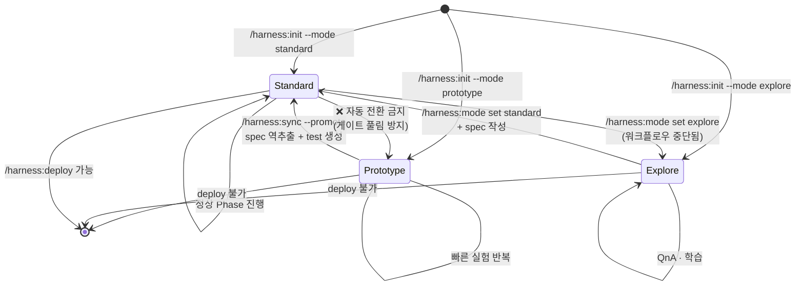
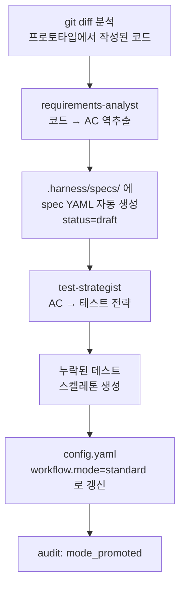

# 4. Prototype → Standard 승격

> **Prototype 모드는 빠른 실험용.** 게이트 대부분이 해제되어 있어 PoC 에 적합하지만, 배포는 불가능하다. 실험이 제품으로 성숙하면 Standard 로 **명시적 승격**이 필요하다.

---

## 4.1 상태 다이어그램



---

## 4.2 세 모드 비교

| 항목 | `standard` | `prototype` | `explore` |
|------|:---------:|:----------:|:--------:|
| 목적 | 배포 가능 제품 | 실험·PoC | QnA·학습 |
| Safety Layer | ✅ | ✅ | ✅ |
| Iron Law Gate (G1~G3) | ✅ | 생략 | 생략 |
| Deploy Gate (G4) | ✅ | ✅ (차단 경고) | ✅ (차단 경고) |
| Prompt Quality Pipeline | ✅ | ✅ | 생략 |
| Spec/Plan 강제 | ✅ | 선택 | 선택 |
| Skill 자동 호출 | ✅ | ✅ | ❌ (description 미로드) |
| `/harness:deploy` 가능? | ✅ | ❌ | ❌ |

자세한 건 [§7 Modes](07-modes.md).

---

## 4.3 승격 절차 (`prototype → standard`)

### Step 1. 코드 동기화

```
/harness:sync --promote
```

내부 동작:



### Step 2. Gate 통과 확인

승격 후 기존 feature 가 G1~G4 를 만족하는지 점검:

```
/harness:mode show                  # mode=standard 확인
/harness:qa <domain>/<feature>      # 필수 테스트 통과 확인
```

### Step 3. 필요 시 재정비

- Spec 이 `draft` 상태 → Domain Expert 검증 후 `approved` 로 올림.
- 테스트 커버리지 부족 → `/harness:implement` 로 test-first 재보강.
- ADR 이 빠진 medium+ feature → `/harness:architect` 로 역작성.

---

## 4.4 왜 자동 전환이 없나

`standard → prototype` 같은 **하향 자동 전환은 금지** 되어 있다:

- 게이트가 조용히 풀리면 품질 파이프라인이 통째로 우회됨.
- 유저가 모르는 사이에 deploy 가 가능해지는 상태는 Iron Law 위반.

반대 방향(승격)도 **유저 명시 호출로만** — auto-detect 는 최초 세션 1회만 동작한다 ([§7.4](07-modes.md#74-auto-detect)).

---

## 4.5 승격 체크리스트

- [ ] `/harness:sync --promote` 실행 완료
- [ ] `.harness/specs/` 에 기존 feature 마다 spec 존재
- [ ] 모든 AC 가 `testable: true`
- [ ] `.harness/plans/` 에 Plan 존재 (AC 매핑 100%)
- [ ] `/harness:qa` 통과
- [ ] Right-Size ≥ medium 인 feature 는 ADR 존재
- [ ] `audit.jsonl` 에 `mode_promoted` 이벤트 기록

---

## 4.6 참고

- Mode 상세: [§7 Modes](07-modes.md)
- Sync 스킬 상세: [`../plugin/skills/sync/SKILL.md`](../plugin/skills/sync/SKILL.md)
- 설계 근거: [`../book/01-philosophy.md`](../book/01-philosophy.md), [`../book/03-workflow.md`](../book/03-workflow.md) §0.4

---

[← 이전: 3. Standard 워크플로우](03-standard-workflow.md) · [인덱스](README.md) · [다음: 5. Migration →](05-migration.md)
