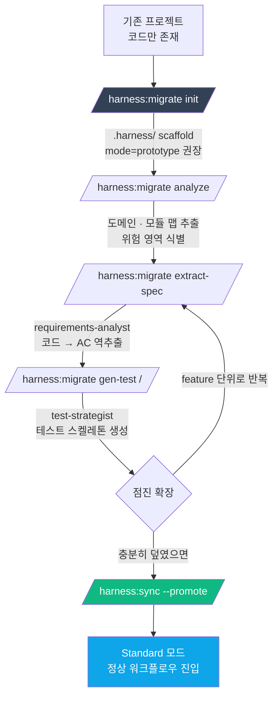
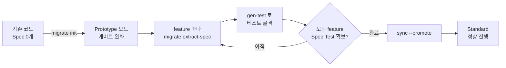

# 5. Migration — 기존 프로젝트에 하네스 편입

> 도메인 C. 이미 코드가 있는 프로젝트에 하네스를 "씌우는" 경로. 전체 리라이트 없이 점진적으로 spec · test · plan 층을 얹는다.

---

## 5.1 전체 흐름

---

## 5.2 서브커맨드 상세

`/harness:migrate` 는 **그룹 스킬**이다 — 서브커맨드로 단계를 나눈다.

| 서브커맨드 | 목적 | 입력 | 산출물 |
|----------|------|------|--------|
| `migrate init` | 하네스 스캐폴드 + mode 기본값 prototype | — | `.harness/config.yaml`, 디렉토리 |
| `migrate analyze` | 코드베이스 전반 진단 (도메인, 기술 부채, 위험 hotspot) | 루트 또는 `--path` | `.harness/decisions/0001-analysis.md` + 리포트 |
| `migrate extract-spec <path>` | 지정 경로의 코드에서 AC 역추출 | 파일/디렉토리 경로 | `.harness/specs/{domain}/{feature}.spec.yaml` (`status=draft`) |
| `migrate gen-test <d>/<f>` | 역추출된 spec 기반 테스트 골격 생성 | spec | `tests/**/*.test.*` (실패 상태 시작) |

---

## 5.3 왜 기본값이 prototype 인가

`migrate init` 은 **mode=prototype 을 기본값**으로 제안한다:

- 기존 코드에 spec·test 가 전혀 없다면 Standard 의 G1~G3 가 전 feature 에서 즉시 실패.
- Prototype 으로 시작해서 feature 단위로 Spec·Test 를 역추출 → Ready 되면 `/harness:sync --promote` 로 Standard 승격 ([§4](04-prototype-to-standard.md)).

---

## 5.4 점진 확장 전략

전체를 한 번에 덮으려 하지 말 것. 순서 권장:

1. **위험 hotspot 부터** — `migrate analyze` 리포트의 "high risk" feature.
2. **배포 빈도 높은 영역** — 회귀 사고 가능성이 큰 곳.
3. **테스트가 전무한 영역** — 새 변경이 닿을 때 Test-First 기반 마련.
4. **신규 feature** — 처음부터 Standard 경로로 (`/harness:spec`).

---

## 5.5 역추출된 Spec 의 품질 관리

`extract-spec` 이 만든 spec 은 **draft** 다 — 반드시 다음을 거친다:

- Domain Expert 페르소나 ([`/harness:persona`](../plugin/skills/persona/SKILL.md)) 로 도메인 정확성 확인.
- Devils-Advocate 에이전트로 빠진 edge case 공격.
- Test-Strategist 가 AC ↔ test 매핑 완성도 검증.
- 상태를 `approved` 로 승격.

---

## 5.6 승격 준비 체크리스트

`sync --promote` 를 부르기 전에:

- [ ] 주요 feature 의 spec 이 `status=approved`
- [ ] 각 spec 의 AC 가 테스트에 매핑 (coverage.json)
- [ ] `qa` 가 프로젝트 Right-Size 기준 필수 테스트를 통과
- [ ] 파괴적 삭제 없이 역추출된 코드 범위가 명확

---

## 5.7 주의점

- **역추출이 완벽하지 않다** — requirements-analyst 가 만든 spec 은 **초안**이다. 도메인 지식으로 반드시 교정.
- **테스트 골격의 실패는 정상** — gen-test 는 실패 상태 테스트부터 만든다 (Red → Green → Refactor).
- **.harness/state/events/** 는 migrate 단계에서 적게 발화한다 — Standard 에 편입되어야 정상 lifecycle 이벤트가 쌓인다.

---

## 5.8 참고

- 스킬 원문: [`../plugin/skills/migrate/SKILL.md`](../plugin/skills/migrate/SKILL.md)
- 설계 근거: [`../book/03-workflow.md`](../book/03-workflow.md) §3 (도메인 C)
- 승격 절차: [§4 Prototype → Standard](04-prototype-to-standard.md)

---

[← 이전: 4. Prototype 승격](04-prototype-to-standard.md) · [인덱스](README.md) · [다음: 6. 슬래시 명령 치트시트 →](06-commands.md)
