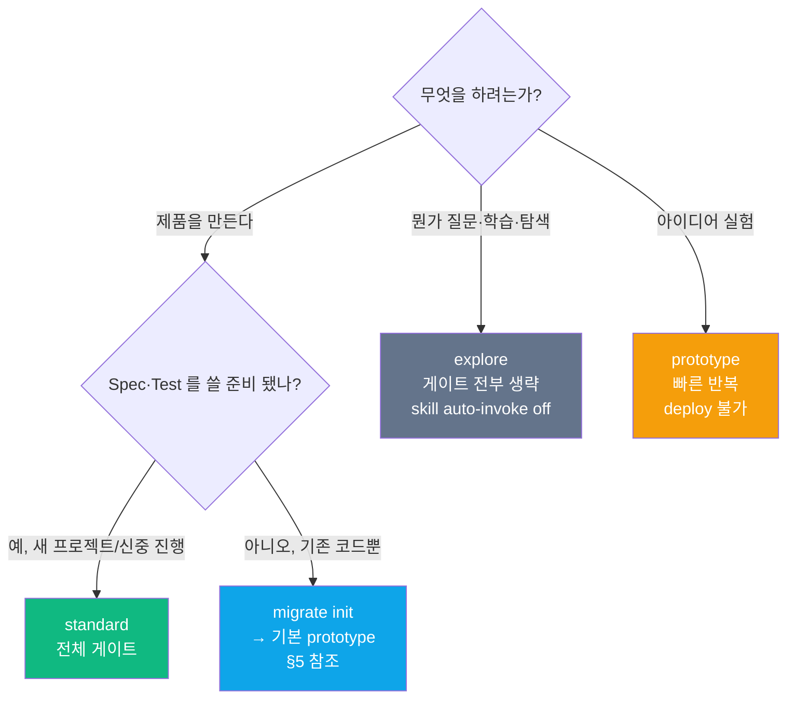
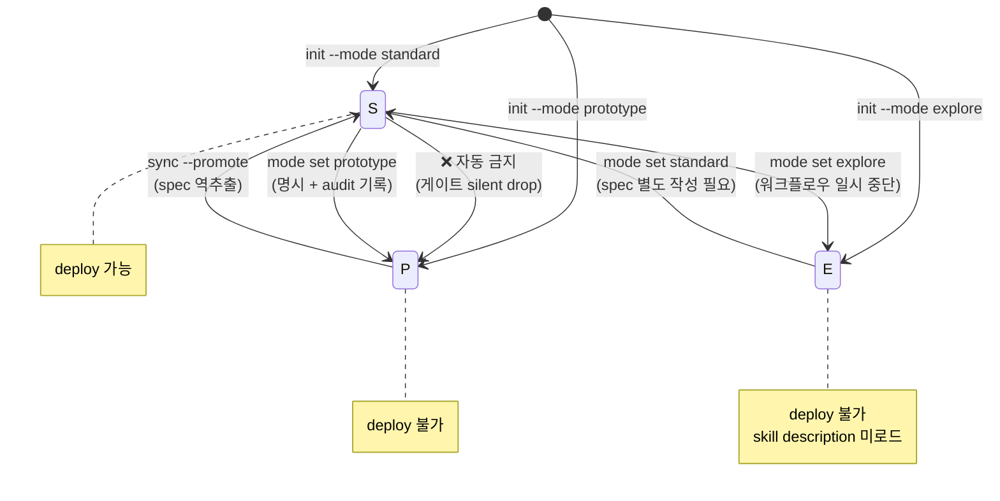
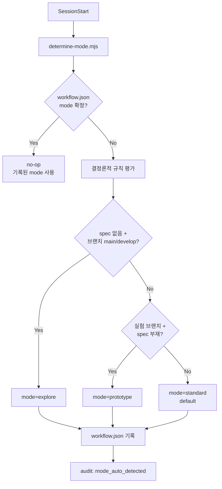

# 7. Mode — standard / prototype / explore

> 세션 mode 는 **어떤 게이트·파이프라인·라우팅이 동작하는지**를 결정한다. 같은 프로젝트라도 세션 시작 시 mode 가 다르면 다른 규칙이 적용된다.

---

## 7.1 한눈에

| 항목 | `standard` | `prototype` | `explore` |
|------|:---------:|:----------:|:--------:|
| 목적 | 배포 가능 제품 | 실험·PoC | QnA·학습 |
| 대상 유저 | 제품 만드는 중 | 아이디어 검증 중 | 공부·질문 |
| Safety Layer (파괴적 bash/force-push/harness 보호) | ✅ | ✅ | ✅ |
| Iron Law Gate G1~G3 (Spec/Plan/Test) | ✅ | 생략 | 생략 |
| Deploy Gate G4 | ✅ | ✅ 차단 경고 | ✅ 차단 경고 |
| Prompt Quality Pipeline | ✅ | ✅ | 생략 |
| Skill auto-invoke (Claude 자동 호출) | ✅ | ✅ | ❌ |
| Router 힌트 | ✅ | 제한적 | ❌ |
| Orchestration (4종 reviewer 병렬 등) | ✅ | 부분 | ❌ |
| `/harness:deploy` | ✅ | ❌ | ❌ |

---

## 7.2 결정 트리



---

## 7.3 모드 전환



**금지 원칙:**

- **자동 하향 금지** — standard → prototype 은 자동으로 일어나지 않음 (게이트가 조용히 풀리면 안전 파괴).
- **session_start_only** — auto-detect 는 오직 첫 세션에서만. 진행 중 재분류 금지.
- **promotion_requires_user** — 하위 → standard 승격은 명시 명령 필요 (`/harness:sync --promote` 또는 `/harness:mode set`).

---

## 7.4 Auto-Detect

`config.yaml` 에 `workflow.mode: auto` 를 넣었을 때만 동작. 실행되는 시점은 **단 하나** — `workflow.json` 에 mode 가 아직 확정되지 않은 **최초 세션**.



- 사용하는 신호: **파일시스템만** (브랜치명, spec 유무, config 힌트). 프롬프트 텍스트 매칭은 오판 위험이 높아 제거됨.
- 한 번 확정되면 이후 세션에서 `determine-mode.mjs` 는 no-op.

---

## 7.5 현재 mode 확인·전환

```
/harness:mode show                         # 현재 mode 와 사유
/harness:mode set standard                 # 수동 전환 (audit 기록)
/harness:mode set prototype                # 필요 시 하향 (명시적)
```

config.yaml 을 직접 편집해도 되지만 `/harness:mode set` 이 audit 까지 남겨서 안전하다.

---

## 7.6 모드별 hook 동작 차이

| Hook | `standard` | `prototype` | `explore` |
|------|:----------:|:-----------:|:--------:|
| Safety (block-destructive/force-push/protect-harness) | ✅ | ✅ | ✅ |
| Trace emitter (6종) | ✅ | ✅ | ✅ |
| Gate Engine | ✅ | G4 만 | 생략 |
| Quality Check + Auto-Transform | ✅ | ✅ | 생략 |
| Route Hint | ✅ | implement 힌트만 | ❌ |

상세 hook 파이프라인은 [§8 Hook Lifecycle](08-hook-lifecycle.md).

---

## 7.7 자주 하는 실수

| 증상 | 원인 | 해결 |
|------|------|------|
| "`/harness:deploy` 가 막힌다" | mode=prototype/explore | `/harness:sync --promote` 또는 `/harness:mode set standard` |
| "prototype 인데 매번 spec 물어봄" | skill 이 auto-invoke 로 `/harness:spec` 를 당김 | `/harness:mode show` 로 확인 → 실제 prototype 이면 spec 는 선택 |
| "explore 인데 skill 이름을 모르겠다" | explore 는 description 미로드 → Claude 가 스킬 못 찾음 | `/harness:<name>` 으로 직접 호출하거나 `/harness:mode set standard` |

---

## 7.8 참고

- 설계 근거: [`../book/03-workflow.md`](../book/03-workflow.md) §0.3~§0.4
- Mode 스킬 원문: [`../plugin/skills/mode/SKILL.md`](../plugin/skills/mode/SKILL.md)
- 승격 상세: [§4 Prototype → Standard](04-prototype-to-standard.md)

---

[← 이전: 6. 명령 치트시트](06-commands.md) · [인덱스](README.md) · [다음: 8. Hook Lifecycle →](08-hook-lifecycle.md)
