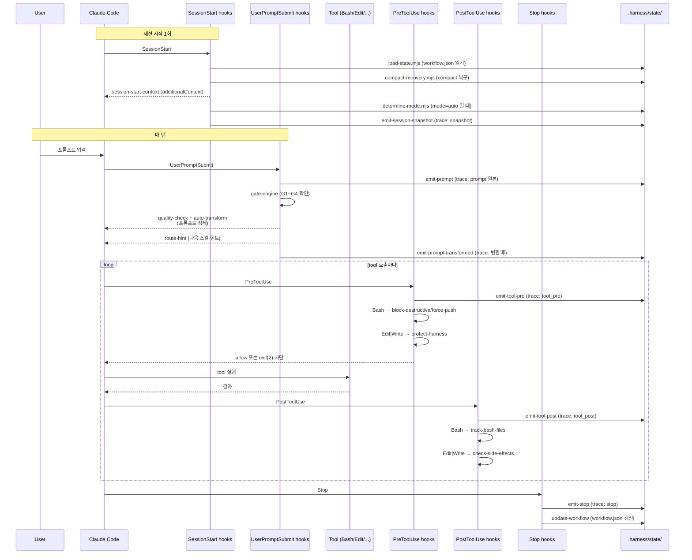

# 8. Hook Lifecycle — 한 턴에 무엇이 일어나는가

> Claude Code 의 hook 포인트를 하네스가 어떻게 체인으로 엮는지. "프롬프트 하나에 왜 이렇게 많은 스크립트가 도나" 를 설명한다.

---

## 8.1 5개 Hook 포인트

Claude Code 가 노출하는 hook 포인트와, 하네스가 각 지점에 매단 스크립트:

| Hook | Matcher | 스크립트 (순서대로) |
|------|--------|------------------|
| **SessionStart** | `""` (모든 세션) | `load-state` → `compact-recovery` → `session-start-context` → `determine-mode` → `emit-session-snapshot` |
| **UserPromptSubmit** | `""` | `emit-prompt` → `gate-engine` → `quality-check` → `auto-transform` → `route-hint` → `emit-prompt-transformed` |
| **PreToolUse** | `""` | `emit-tool-pre` |
| **PreToolUse** | `Bash` | `block-destructive` · `block-force-push` |
| **PreToolUse** | `Edit\|Write` | `protect-harness` |
| **PostToolUse** | `""` | `emit-tool-post` |
| **PostToolUse** | `Bash` | `track-bash-files` |
| **PostToolUse** | `Edit\|Write` | `check-side-effects` |
| **Stop** | `""` | `emit-stop` → `update-workflow` |

> 같은 hook 에 여러 matcher 블록이 있으면 전부 실행된다. 예: `PreToolUse` 에서 Bash 호출은 `""` (trace) + `Bash` (safety) 두 블록이 모두 발화.

---

## 8.2 한 턴 시퀀스 다이어그램



---

## 8.3 Hook 체인 내 순서가 중요한 이유

### UserPromptSubmit 의 순서

```
emit-prompt → gate-engine → quality-check → auto-transform → route-hint → emit-prompt-transformed
```

- `emit-prompt` 가 **가장 먼저** — 원본 프롬프트를 보존해야 이후 변환과의 diff 를 기록할 수 있음.
- `gate-engine` 이 두 번째 — 금지된 명령(예: prototype 에서 deploy)을 이 시점에 차단.
- `quality-check` → `auto-transform` — 프롬프트 품질 이슈 검출 후 변환. **순서 바뀌면 변환본을 다시 검사하게 됨.**
- `emit-prompt-transformed` 가 **마지막** — 변환된 최종 프롬프트를 캡처.

### PreToolUse 의 순서

```
"" matcher (trace) ← 먼저
Bash matcher (safety)
Edit|Write matcher (protect-harness)
```

Safety 스크립트는 `exit(2)` 로 tool 을 차단할 수 있지만, `""` matcher 의 `emit-tool-pre` 는 **먼저** 실행되어 **차단된 시도도 trace 에 기록**된다.

---

## 8.4 Hook 이 tool 을 막는 방법

| Exit Code | 의미 | 동작 |
|-----------|------|------|
| `0` | 정상 | tool 계속 진행 |
| `2` | 정책 차단 | Claude Code 가 tool 을 **실행하지 않음**. stderr 가 Claude 에게 전달 |
| 기타 비제로 | 내부 오류 | hook 실패. Trace emitter 는 이 경우에도 **tool 을 막지 않음** (`runTrace` 가 항상 exit(0)) |

Trace 스크립트의 실패로 인해 사용자가 작업을 못 하는 상황을 방지하려는 설계.

---

## 8.5 이 모든 것이 적히는 곳

- **Trace** — `.harness/state/traces/{session_id}.jsonl` (모든 hook/tool 발화)
- **Audit** — `.harness/state/audit.jsonl` (정책 판단)
- **Events** — `.harness/state/events/{domain}/{feature}/{YYYY-MM}.jsonl` (feature lifecycle)

자세한 건 [§9 Observability](09-observability.md).

---

## 8.6 Hook 이 왜 느려 보일 때

- 각 hook 스크립트는 **별도 node 프로세스**로 실행됨 (subprocess startup 25~30ms).
- PreToolUse 에서 한 tool 당 최대 3~4 스크립트가 돌면 누적 ≈ 100ms.
- trace emitter 의 p95 ≈ 35ms — inspector 관측에서 개별 스크립트 시간 확인 가능.

이 비용은 **관찰 가능성의 대가**다. 줄이려면 explore 모드(hook 일부 생략) 또는 향후 batching (v0.4+).

---

## 8.7 참고

- hook 정의 원문: [`../plugin/hooks/hooks.json`](../plugin/hooks/hooks.json)
- 설계: [`../book/07-hooks-system.md`](../book/07-hooks-system.md)
- 스크립트 소스: [`../plugin/scripts/`](../plugin/scripts/)

---

[← 이전: 7. Modes](07-modes.md) · [인덱스](README.md) · [다음: 9. Observability →](09-observability.md)
