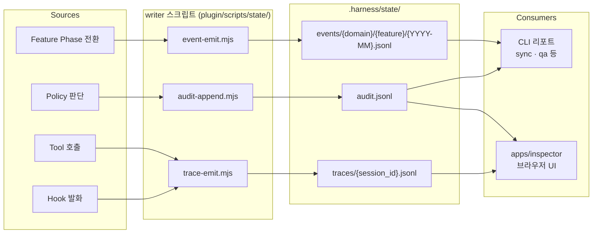

# 9. Observability — 3개 이벤트 스트림

> 하네스의 동작을 관측하는 **3개 직교(orthogonal) 스트림**. 각각 다른 질문에 답한다.

---

## 9.1 전체 구조



---

## 9.2 3개 스트림 비교

| 스트림 | 질문 | 단위 | 파일 | Writer |
|-------|------|------|------|--------|
| **audit** | "왜 이 판단이 내려졌나?" | 단일 정책 이벤트 | `.harness/state/audit.jsonl` | `audit-append.mjs` |
| **events** | "이 feature 는 어떤 phase 를 거쳤나?" | feature lifecycle | `.harness/state/events/{domain}/{feature}/{YYYY-MM}.jsonl` | `event-emit.mjs` |
| **traces** | "런타임에 무엇이 발화했나?" | session-scoped timeline | `.harness/state/traces/{session_id}.jsonl` | `trace-emit.mjs` |

같은 "auth/login spec 이 만들어졌다" 는 사건이라도:

```jsonc
// audit
{"event": "spec_validated", "rule_id": "AC-TESTABLE-001", "result": "pass"}

// events
{"type": "SpecCreated", "payload": {"domain": "auth", "feature": "login", "ac_count": 3}}

// traces
{"kind": "tool_pre", "tool": "Write", "data": {"input": {"path": ".harness/specs/auth/login.spec.yaml"}}}
```

세 관점이 동시에 기록된다.

---

## 9.3 Trace 스트림 스키마 (v1)

```jsonc
{
  "v": 1,
  "ts": "2026-04-19T10:23:45.123Z",
  "session_id": "abc-123",
  "turn": 3,
  "span_id": "span-a1b2c3d4",
  "parent_span_id": null,
  "kind": "tool_pre",
  "source": "PreToolUse",
  "tool": "Bash",
  "data": { "input": { "command": "ls" } }
}
```

| kind | 용도 | 발생 시점 |
|------|------|---------|
| `snapshot` | rules/skills/MCP 목록 | SessionStart |
| `prompt` | 유저 프롬프트 원본 | UserPromptSubmit 선두 |
| `prompt_transformed` | auto-transform 후 | UserPromptSubmit 말미 |
| `tool_pre` | tool 호출 직전 | PreToolUse |
| `tool_post` | tool 완료 | PostToolUse |
| `hook` | hook 자신의 판단 (guardrails 등) | 각 hook 내부 |
| `stop` | 턴 종료 | Stop |
| `turn_start` / `turn_end` | 턴 경계 | (구현된 범위만) |

---

## 9.4 Inspector 로 시각화

[`apps/inspector`](../../../apps/inspector/README.md) 는 trace 파일을 브라우저에서 실시간 관찰하는 웹 UI.

```bash
# 이 레포 자체 trace
pnpm inspector

# 다른 프로젝트 관찰
HARNESS_PROJECT_DIR=/path/to/project pnpm inspector
```

### Inspector 탭 ↔ trace kind 매핑

| 탭 | 렌더하는 kind | 용도 |
|----|------------|------|
| **Timeline** | 전부 | Gantt 스타일 span nesting |
| **PromptDiff** | `prompt` + `prompt_transformed` 페어 | auto-transform before/after |
| **Snapshot** | `snapshot` | 세션 시작 시점의 rules/skills/MCP |
| **SubagentTree** | `tool_pre` (Task) + 자식 | subagent 호출 트리 |
| **Lifecycle** | 전부 (발화 노드 점등) | Claude Code 전체 hook 그래프 |

### 실시간 동기화

- Inspector 는 `.harness/state/traces/` 를 `fs.watch` 로 관측.
- 파일이 아직 없어도 1초 폴링으로 생성 대기 → init 후 자동 반영.
- 브라우저는 SSE(`/api/stream`) 로 delta 수신.

---

## 9.5 Audit 스트림

| 필드 | 예시 |
|------|------|
| `event` | `spec_validated`, `mode_auto_detected`, `qa_invoked` |
| `rule_id` | `AC-TESTABLE-001`, `G4-QA-PASSED` |
| `result` | `pass` / `block` / `warn` |
| `reason` | 유저가 `--reason` 으로 남긴 사유 |

rotation 은 `config.yaml` 의 `audit.rotate_mb` / `retention_days` 로 제어. 기본 10MB / 90일.

---

## 9.6 Events 스트림

Feature lifecycle 을 도메인별·월별 파티션으로 저장.

```
.harness/state/events/
├── auth/
│   └── login/
│       ├── 2026-03.jsonl
│       └── 2026-04.jsonl
└── billing/
    └── checkout/
        └── 2026-04.jsonl
```

Snapshot fold 재료 — 여러 이벤트를 접어서 현재 상태(`workflow.json`)를 복원할 수 있는 소스.

---

## 9.7 어떤 스트림을 봐야 하는가

| 상황 | 볼 것 |
|------|------|
| "왜 이 뽑히지(블록) 됐지?" | **audit** — rule_id + reason 확인 |
| "이 feature 가 어디까지 왔지?" | **events** — 최신 phase 이벤트 |
| "방금 어떤 hook 이 실제로 돌았지?" | **traces** — Inspector Timeline |
| "프롬프트가 어떻게 변환됐지?" | **traces** — Inspector PromptDiff |
| "전체 세션 재생" | **traces** — Inspector (session_id 로) |

---

## 9.8 참고

- 설계 원문: [`../book/10-state-and-audit.md`](../book/10-state-and-audit.md)
- Trace spec: [`../bench/specs/trace-emit.spec.yaml`](../bench/specs/trace-emit.spec.yaml)
- Inspector: [`../../../apps/inspector/README.md`](../../../apps/inspector/README.md), [`../../../apps/inspector/CONVENTIONS.md`](../../../apps/inspector/CONVENTIONS.md)

---

[← 이전: 8. Hook Lifecycle](08-hook-lifecycle.md) · [인덱스](README.md) · [다음: 10. State 디렉토리 →](10-state-directory.md)
